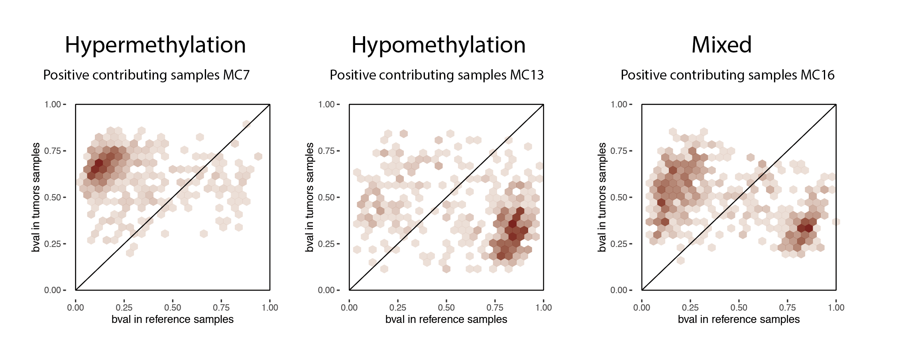
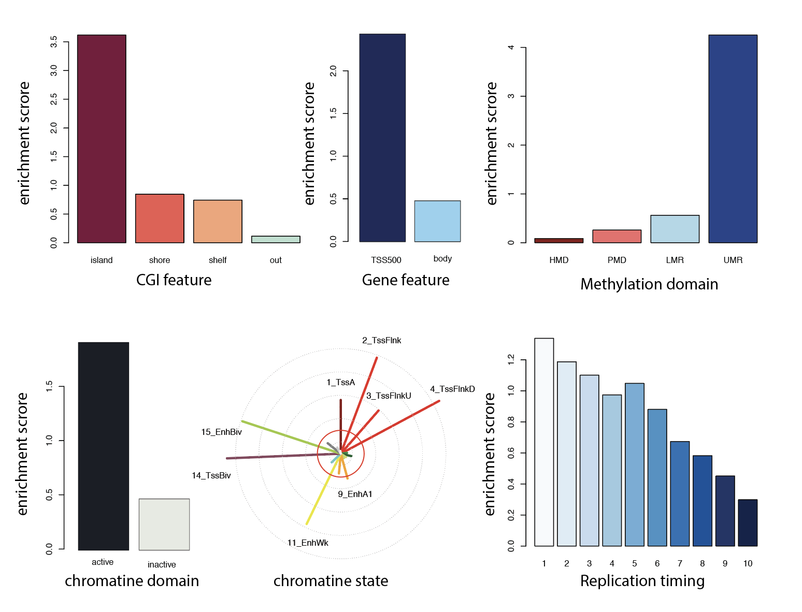
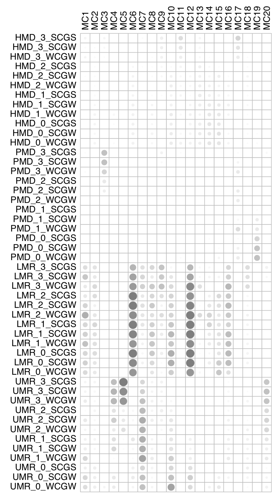
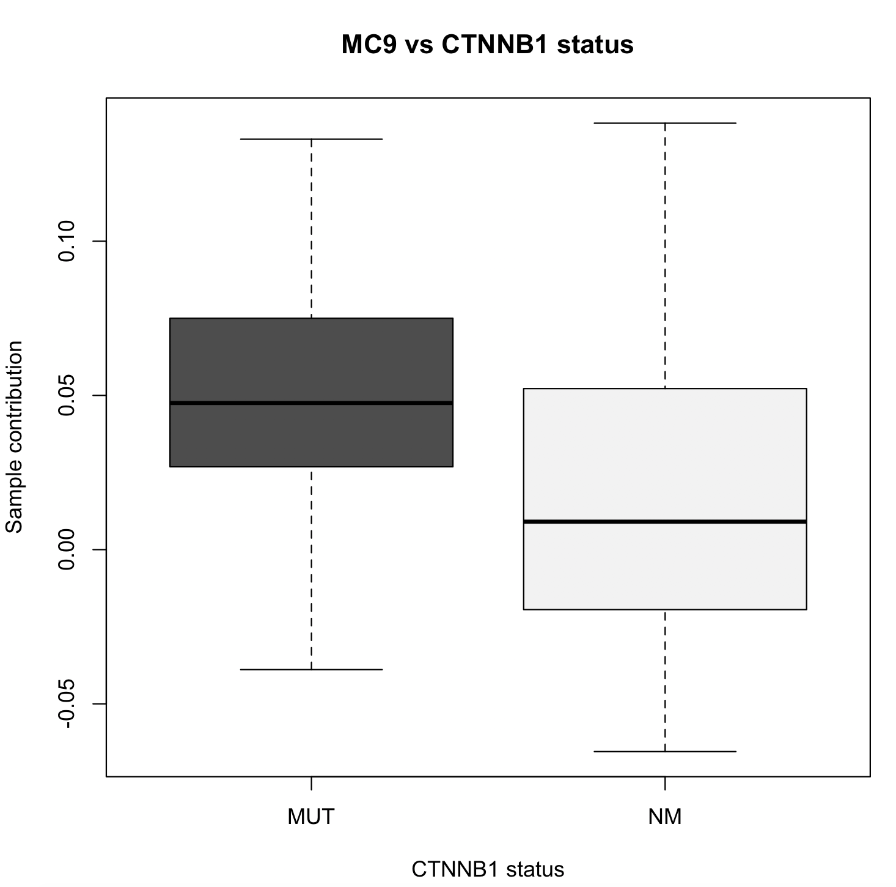
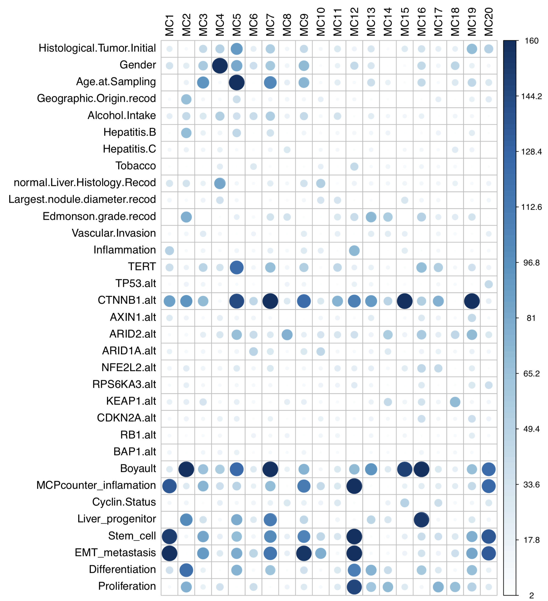
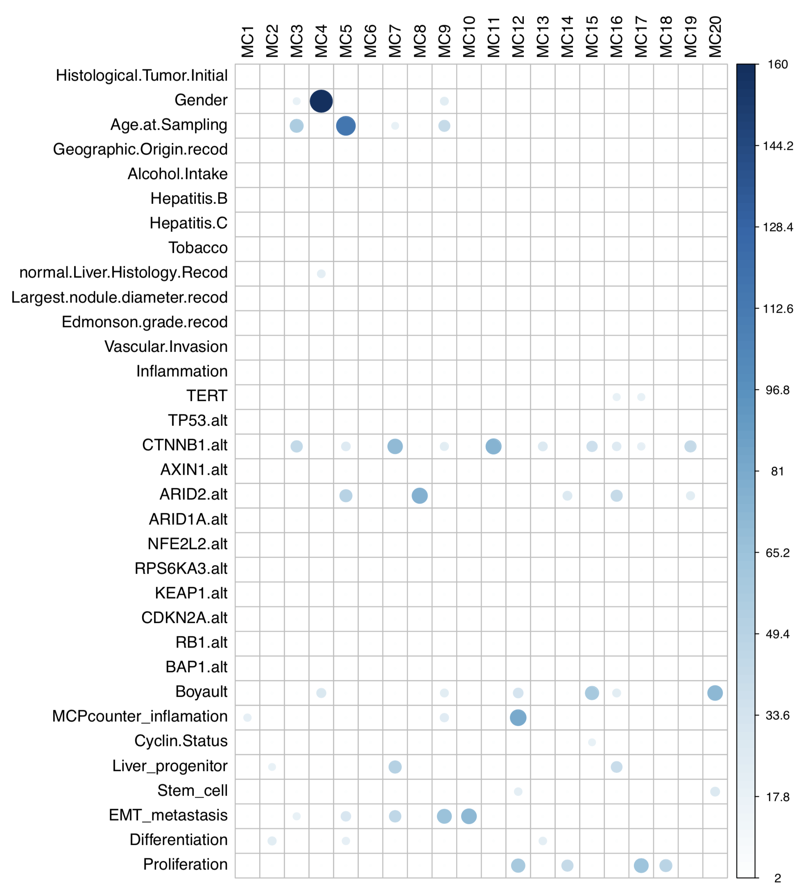

```{r setup, include=FALSE}
knitr::opts_chunk$set(echo = TRUE)
```

# Abstract

<p>DNA methylation changes are widespread in human cancers, but the underlying molecular mechanisms remain incompletely understood. We developed an innovative statistical framework, MethICA, leveraging independent component analysis to identify sources of DNA methylation changes in tumors. The package includes a function that uses independent component analysis to extract epigenetic signatures from methylation data, as well as functions to calculate associations with sample annotations and CpG characteristics. The package also provides representations that facilitate the interpretation of methylation components. This document, paired with the “MethICA_examples_script.R” demo script, outlines the typical workflow for analyzing methylation signatures in a cancer series with MethICA.</p>

# Package

Report issues at <https://github.com/FunGeST/MethICA>.


\newpage

# Introduction


# Installation Instructions

The latest version of the package can be installed from the FunGeST GitHub repository using devtools:
```{r install, eval = FALSE, echo = TRUE}
install.packages("devtools")
library(devtools)
devtools::install_github("FunGeST/MethICA")

```
# Dependencies

<p>The R packages stringr, fastICA, cowplot, ggplot2, RColorBrewer, plotrix and broom are required to perform MethICA analysis</p>

# Input data

Input files are necessary to perform the core MethICA analyses:
<ul>
<li>bval: methylation levels for each CpG or region (rows) in each sample (columns)
<li>CpG annotation: CpG table annotated with various (epi)genomic features 
<li>sample annotation: relevant sample annotations to interpret the components
</ul>

<p>Please check the README file for detailed description of input files. Examples are also provided with the package.</p>


## Load methylation data and annotations

Once installed, load the package and you’re ready to go! 
```{r chargepackage, eval = FALSE, echo = TRUE}
# Load MethICA package
library(MethICA)
library(corrplot)
```

Define output directories.
```{r chargedata, eval = FALSE, echo = TRUE}
# define output directory> 
output.directory = "~/Test_MethICA/"
if(!dir.exists(output.directory)){
  dir.create(output.directory)
}
```

We provide example datasets from our hepatocellular carcinoma study containing bval methylation table, annotation table and CpG feature for liver data that can be loaded here: https://drive.google.com/drive/folders/1BTQOhvI_qQou1CD94N_TCV_TEbcBC671?usp=sharing
```{r chargeLICAFR, eval = FALSE, echo = TRUE}
# load example dataset> 
data.directory <- "~/Downloads/MethICAdata/"
load(file.path(data.directory,'LICAFR_methylation.Rdata'),verbose = T)
```

Select the most variant CpG sites (based on standard deviation) for the analysis.
```{r selectMostVar, eval = FALSE, echo = TRUE}
# Select most variant CpG sites 
NmostVar = 100000
mysd <- apply(bval,1,sd)
sel <- order(mysd,decreasing=T)[1:NmostVar]
# Reduce bval and CpG_feature matrix
bval <- bval[sel,];dim(bval)
CpG_feature <- CpG_feature[rownames(bval),]
```

## Prepare CpG annotation table

MethICA uses various (epi)genomic annotations of CpG sites to interpret methylation components. Make sure you use correct annotations for the tissue under study. For example, the CpG_feature.Rdata file included in the package corresponds the CpG annotation table of liver tissue used in our hepatocellular carcinoma study. We provide the chromatin.feature function to annotate your own CpG table. It requires different inputs for each (epi)genomic feature that can be obtained from various sources. For example, here are the links we used for our study:
<ul>
<li>file_CGI : CpG island-based features (Island, Shore, Shelf, out of cgi) from UCSC (not liver specific)
<li>file_genes : gene-based features (body, TSS500) from GENCODE <https://www.gencodegenes.org/human/release_34lift37.html> (not liver specific)
<li>file_chrom_state : chromatin states defined from various histone marks by the ROADMAP epigenomics project (liver specific) <https://egg2.wustl.edu/roadmap/web_portal/chr_state_learning.html#exp_18state>
<li>file_CpG_context : methylation domains (HMD/PMD/LMR/UMR) defined from WGBS data (liver specific) <https://www.ncbi.nlm.nih.gov/geo/download/?acc=GSE113405&format=file&file=GSE113405%5FLIV%5FADLT%2EMethylSeekR%2Esegments%2Ebed%2Egz>
<li>file_replication : replication timing deciles obtained from Repli-Seq data availbale on the ENCODE project data portal. Here we used Repli-Seq from HepG2 cell line accessible under GEO accession number GSM923446 (liver specific) <https://www.ncbi.nlm.nih.gov/geo/query/acc.cgi?acc=GSM923446> 
</ul>

<p> The script used to extensively annotate CpG features (feature_table_script.R) is provided in the RUNNING_MethICA_example folder. It uses various types of (epi)genomic data (CpG islands, genes, chromatin states, methylation domains) to annotate the tissue-specific context of each CpG site.


# Extract methylation components with ICA

The mc.extract function performs independent component analysis (ICA) and extracts methylation components from the methylation matrix.
<ul>
<li> input: bval methylation matrix 
<li> outputs: MC_object with two matrices giving the contribution of CpGs and samples to each component, and one vector giving components stability. If compute_stability = TRUE (recommended), mc.extract performs n iterations of ICA, computes stability and selects the most stable iteration,. If compute_stability = FALSE, mc.extract performs a single iteration of ICA and returns NA in stability vector
</ul>

```{r ICA, eval = FALSE, echo = TRUE}
MC_object <- mc.extract(bval, nb_comp = 20, compute_stability = TRUE, nb_iteration = 20, output.directory = output.directory, save = TRUE)
```

<p>Each methylation component (MC) is characterized by an activation pattern across CpG sites and across samples. To interpret their biological meaning, we first select the most contributing CpGs and samples for each MC.</p>

<p>The mc.active.CpG function identifies CpGs with a contribution greater than a defined threshold (method="threshold", recommended) or extracts a defined number of most contributing CpGs (method="number").</p>

<p>The mc.active.sample function identifies the most contributing samples (method="absolute") or those showing the greatest deviation from a set of reference samples (method="reference").</p>


```{r contributing, eval = FALSE, echo = TRUE}
# Extract the most contributing CpG sites for each MC
MC_contrib_CpG <- mc.active.CpG(MC_object, method = "threshold")

# Extract the most contributing samples for each MC...
# based on absolute value of contribution 
MC_active_sample = mc.active.sample(MC_object, method = c("absolute", "reference")[1],bval = bval , MC_contrib_CpG = MC_contrib_CpG, number = round(nrow(MC_object$Sample_contrib)*0.1))
# or based on differential methylation level with reference sample (here normal samples)
MC_active_sample = mc.active.sample(MC_object, method = c("absolute", "reference")[2],bval = bval , MC_contrib_CpG = MC_contrib_CpG, number = round(nrow(MC_object$Sample_contrib)*0.1), ref = grep("N", colnames(bval), value = TRUE))
```

# Represent methylation changes

<p>We then use the mc.change function to identify the major methylation changes associated with each component. This function plots the average methylation of the most contributing CpGs in the most contributing samples versus reference samples. Examples below represent components associated mostly with hypermethylation, hypomethylation or both. If highly contributing samples include samples with high positive and negative contributions, two distinct graphs are produced. </p>

```{r MC_change, eval = FALSE, echo = TRUE}
#Represent methylation changes in most contributing tumors vs. normal samples
mc.change(MC_object, MC_active_sample, MC_contrib_CpG, bval, ref = grep("N", colnames(bval), value = TRUE), output.directory = output.directory)
```

Examples of outputs: 
{width=100% height=100%}

# Explore epigenomic characteristics of the most contributing CpGs

To better understand the components, we then explore the characteristics of their most contributing CpGs. The enrich.CpG.feature function computes enrichment scores of CpGs across epigenomic features from the CpG_feature table and generates various visual outputs. The example below shows a hypermethylation component affecting preferentially CpG sites located in CpG islands near transcription start sites, with bivalent chromatin state. The "other_feature_to_test" option of enrich.CpG.feature function allows to compute enrichment and generate barplots for any additional feature.

```{r enrich_CpG, eval = FALSE, echo = TRUE}
# Association of MCs with (epi)genomic characteristics
enrich.CpG.feature(MC_object, MC_contrib_CpG, output.directory = output.directory, CpG_feature = CpG_feature)
```

Example of outputs for MC5 component: 
{width=80% height=80%}

<p> Zhou et al. described 48 CpG categories based on the methylation domain, number of flanking CpG and adjacent nucleotides (Zhou et al., Nat Genet 2018) that are more or less prone to hypomethylation in human tissues. MethICA allows to annotate these CpG categories, compute and represent enrichments of MCs most contributing CpG sites within these categories.</p>

```{r enrich_CpG_Zhou, eval = FALSE, echo = TRUE}
# Compute and represent enrichment of 48 CpG categories as in Zhou W et al. (Nat Genet 2018)
# create table with categories
CpG_feature = enrich.CpG.domain(CpG_feature = CpG_feature, MC_contrib_CpG = MC_contrib_CpG, MC_active_sample = MC_active_sample)
```

<p> Example of outputs for 48 CpG context in the 20 components: </p>
{width=40% height=40%}


# Association with sample annotations

<p>The final step is to analyze the characteristics of samples most strongly contributing to each component. The mc.annot function first performs univariate linear regressions to identify annotations associated with each MC. Significant annotations are then included in multivariate analyses to determine the strongest determinants of each MC.</p>

```{r assos_annot, eval = FALSE, echo = TRUE}
# Association of MCs with clinical and molecular features
sample.assoc = mc.annot(MC_object, annot = annot , save = TRUE, output.directory = output.directory)
```

Examples of possible representation with this results :
<ul>
<li> boxplot for one component vs one feature
</ul>

```{r assos_annot_exemples, eval = FALSE, echo = TRUE}
# Association of MCs with clinical and molecular features
boxplot(MC_object$Sample_contrib[,"MC13"]~ annot[,"CTNNB1.alt"], col = c("grey30", "grey95"), ylab = "Sample contribution", xlab = "CTNNB1 status", main = "MC13 vs CTNNB1 status")
```


{width=30% height=30%}


<ul>
<li> corrplot of all components vs all features (top = univariate, bottom = multivariate): 
</ul>

```{r assos_annot_exemples_corrplot, eval = FALSE, echo = TRUE}
#corrplot representation for univariate and multivariate analyses
association.corrplot(pvaltab_uni = sample.assoc$pval_uni , pvaltab_multi = sample.assoc$pval_multi)
```
 
{width=60% height=60%}
{width=60% height=60%}

<p>p-value circle/color legend (see echelle_log on the MethICA_example_script.R)<p>
<ul>
<li>1 = 1
<li>0.1 = 17
<li>0.05 = 22
<li>0.01 = 33
<li>1.0 10-4 = 65
<li>1.0 10-6 = 96
<li>1.0 10-8 = 128
<li>0 = 160
</ul>
