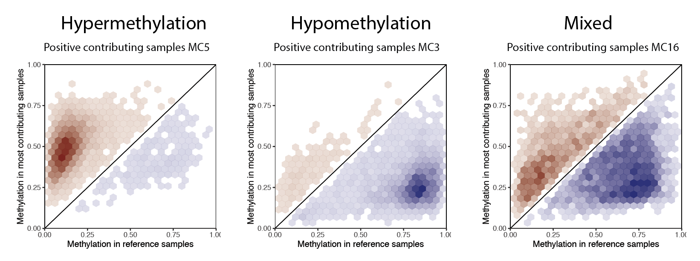

```{r setup, include=FALSE}
knitr::opts_chunk$set(echo = TRUE)
```

# Abstract

<p>DNA methylation changes are widespread in human cancers, but the underlying molecular mechanisms remain incompletely understood. We developed an innovative statistical framework, MethICA, leveraging independent component analysis to identify sources of DNA methylation changes in tumors. The package includes a function that uses independent component analysis to extract methylation signatures from bval data, as well as functions to calculate associations with sample annotations and CpG characteristics. The package also provides representations that facilitate the interpretation of signatures. This document, paired with the “MethICA_examples_script.R” demo script, outlines the typical workflow for the analyis of thegenomic data from a series of tumours.</p>

# Package

Report issues at <https://github.com/FunGeST/MethICA>.


\newpage

# Introduction


# Installation Instructions

The latest version of the package can be installed from the FunGeST GitHub repository using devtools:
```{r install, eval = FALSE, echo = TRUE}
install.packages("devtools")
library(devtools)
devtools::install_github("FunGeST/MethICA")

```
# Dependencies

<p>The R packages stringr, fastICA, cowplot, ggplot2, RColorBrewer, plotrix and broom are required to perform MethICA analysis</p>

# Input data

Input files are necessary to perform the core MethICA analyses:
<ul>
<li>Bval: methylation level of CpG (rownames) in samples (colnames)
<li>CpG annotation: File listing CpG information. 
<li>Sample annotation: Minimal sample annotation data.
</ul>

<p>Please refer to the example files provided with the package for the correct format. You can also check out the README file for further information about the formats of the input files</p>


## loading methylation data and annotations

Once installed, load the package and the data and you’re ready to go! 
```{r chargepackage, eval = FALSE, echo = TRUE}
> # Load MethICA package
> library(MethICA)
```

Next we charge input data, and the desired output directory.
```{r chargedata, eval = FALSE, echo = TRUE}
> # define input directory containing example dataset> 
> datadir <- "~/Documents/MethICA/RUNNING_MethICA_EXAMPLE/LICAFR"
>
> # define output directory> 
> output.directory <- "~/Results/"> 
> if(!file.exists()){
>  dir.create(output.directory)
> }
```

We provide example input datasets with this package in the data directory, from our paper, which can be loaded as follows:
```{r chargeLICAFR, eval = FALSE, echo = TRUE}

> # carge example dataset> 
> bval = load.RData(file.path(datadir, 'RUNNING_MethICA_exemple/LICAFR/bval.Rdata'))
> annot = load.RData(file.path(datadir, 'RUNNING_MethICA_exemple/LICAFR/LICAFR_annot.RData'))
>
> # Select most variant CpG sites 
> NmostVar = 200000
> mysd <- apply(bval,1,sd)
> sel <- order(mysd,decreasing=T)[1:NmostVar]
> # Reduce bval and CpG_feature matrix
> bval <- bval[sel,];dim(bval)
> CpG_feature <- CpG_feature[rownames(bval),]
```
We select the 200 000 most variant CpG (based on sd) to keep only CpG with methylation variation in our data set.

## Preparing CpG feature input data

MethICA works with CpG annotation. Ensure that you choce the appropriate reference annotation for your data. The CpG_feature.Rdata provided in the package correspond to the chromatin annotations for the hepatocellular carcinoma sample study for the hg19 reference genome. This table was generated with the function chromatin.feature which takes different inputs for each annotation : 
<ul>
<li>cgi_feature : CpG density (Island, Shore, Shelf, out of cgi) 
<li>gene_name and gene_feature : from GENCODE hg19 reference genome <https://www.gencodegenes.org/human/release_34lift37.html>
<li>state and domain : Chromatine state and domain from ROADMAP epigenomics project <https://egg2.wustl.edu/roadmap/web_portal/chr_state_learning.html#exp_18state>
<li>CpG_context : Methylation domain (HMD/PMD/LMR/UMR) from  <https://www.ncbi.nlm.nih.gov/geo/download/?acc=GSE113405&format=file&file=GSE113405%5FLIV%5FADLT%2EMethylSeekR%2Esegments%2Ebed%2Egz>
<li>decile : decile of Replication timing signals of HepG2 (1: early --> 10: late) downloaded from the ENCODE project data portal and they are accessible under GEO accession numbers GSM923446 <https://www.ncbi.nlm.nih.gov/geo/query/acc.cgi?acc=GSM923446> 
</ul>

```{r CpG_feature, eval = FALSE, echo = TRUE}
> # Annotate CpG table with various epigenomic features
> #CpG_table = load.RData('~/Google Drive/MethICA/data/CPG_feature_Illumina.RData')
> CpG_feature = chromatin.feature(CpG_table = CpG_table, file_CpG_context = "MethICA/data/GSE113405_LIV_ADLT.MethylSeekR.segments.bed", name_col_CpG_context = "CpG_context", file_chrom_state = 'MethICA/data/cst18_liver.RData', name_col_chrom_state = c("state", "active"), file_CGI = "MethICA/data/CGI-based_features_hg19.txt", name_col_CGI ="cgi_feature", file_genes = "MethICA/data/Gene-based_features_hg19.txt", name_col_genes = c("gene_name", "gene_feature"), file_replication ="MethICA/data/HepG2_replication_domains.RData", name_col_replication = "decile", add_seq_info = TRUE, save = TRUE, output.directory = output.directory)
```

# Extract Methylation signature with ICA

Perform Independent signature analysis (ICA) with function mc_extract 
<ul>
<li> input: bval matrix 
<li> outputs: MC object with two matrices giving the contribution of CpGs and samples to each component and one vector giving components stability. If compute_stability = TRUE Perform n ICA, compute stability (recommended) and choose the most stable iteration, if compute_stability = FALSE, keep the first itteration and return NA in stability vector
</ul>

```{r ICA, eval = FALSE, echo = TRUE}
> MC_object <- mc.extract(bval, nb_comp = 20, compute_stability = TRUE, nb_iteration = 100, output.directory = output.directory, save = TRUE)
```

<p>Each signature is characterized by a contribution value of each CpG and an activity in the different samples. To facilitate the interpretation of the components, the groups of CpGs that are influential in each component and the samples in which the components are highly active are determined and are returned by the function mc.activ.sample and mc.active.CpG as a list.</p>

<p>To determine the most active CpGs, one can select a defined number of CpGs (method = "number", example = 2000 most contributing CpGs in the component) or set a contribution threshold and select CpGs with an activity above this threshold (recommended option, the default threshold corresponds to the contribution value where 5% of all CpGs in all components are higher). As the contribution of the CpGs can be negative or positive, the absolute value is used to select them.</p>

<p>To determine the most active samples, (number selected by default = 10 percent of the total number) we have 2 options: We can select the samples based on their absolute value of contribution (as for CpG), or use a group of reference samples (in our case normal samples) and select the tumors that have the largest methylation differential with this reference.</p>

```{r contributing, eval = FALSE, echo = TRUE}
> # Extract the most contributing CpG sites for each MC
> MC_contrib_CpG <- mc.active.CpG(MC_object, method = "threshold")
>
> # Extract the most differentially methylated samples for each MC
> # Extract the most contributing samples for each MC based on absolute value of contribution 
> MC_active_sample = mc.activ.sample(MC_object, method = c("absolute", "reference")[1],bval = bval , MC_contrib_CpG = > MC_contrib_CpG, number = round(nrow(MC_object$Sample_contrib)*0.1), output.directory = output.directory)
> # Extract the most contributing samples for each MC based on differential methylation level with reference sample (here normal samples)
> MC_active_sample = mc.activ.sample(MC_object, method = c("absolute", "reference")[2],bval = bval , MC_contrib_CpG = > MC_contrib_CpG, number = round(nrow(MC_object$Sample_contrib)*0.1), ref = grep("N", colnames(bval), value = TRUE), output.directory = output.directory)
```

# Represent methylation changes

<p>The first step in interpretation is to determine the major methylation changes extracted in the component. Is it predominantly hyper methylation, hypomethylation or a combination of both. This is done by representing the average methylation level of the most contributing CpGs in the active samples of the component compared to the reference. This is done by separating the samples into two groups, those with positive activity in the component and those with negative activity.</p>

```{r MC_change, eval = FALSE, echo = TRUE}
> #Represent methylation changes in most contributing tumors vs. normal samples
> mc.change(MC_object, MC_active_sample, MC_contrib_CpG, bval, ref = grep("N", colnames(bval), value = TRUE), output.directory = output.directory)
```

Example of generated figure: 
{width=100% height=100%}

# Calculation and visualization of the characteristics of the contributing CpGs in the components

A part of the interpretation of the components is based on the characteristics of the most contributing CpGs. The different chromatin annotations filled in the CpG_feature table are used to perform enrichment analyses and to see if the CpGs that drive the component present particular characteristics compared to the set of CpGs used for the analysis. These results are shown in a figure to facilitate interpretation.

```{r enrich_CpG, eval = FALSE, echo = TRUE}
> # Association of MCw with (epi)genomic characteristics
> enrich.CpG.feature(MC_object, MC_contrib_CpG, output.directory = output.directory, CpG_feature = CpG_feature)
```

Example of generated figure for MC7 component: 
{width=80% height=80%}

# Association with sample annotations

<p>The final step in interpreting the components is to see in which samples they are active and whether these samples have anything in common at the clinical or molecular level. For this purpose the function mc.annot allows to perform a univariate statistical analysis with linear regression to determine the annotations significantly associated with MC. The second part of this function allows a multivariate analysis to be performed to see which annotations are significantly associated with the first statistical analysis and which may be most related.</p>

```{r assos_annot, eval = FALSE, echo = TRUE}
> # Association of MCs with clinical and molecular features
> Samples_association = mc.annot(MC_object, annot = annot , save = TRUE, output.directory = output.directory, seuil_multi = 0.001)
```

Example of possible representation for association between annotations and components (left = univariate, rigth = multivariate): 
{width=90% height=90%}
<p>p-value circle/color legend (see echelle_log on the MethICA_example_script.R)<p>
<ul>
<li>1 = 1
<li>0.1 = 17
<li>0.05 = 22
<li>0.01 = 33
<li>1.0 10-4 = 65
<li>1.0 10-6 = 96
<li>1.0 10-8 = 128
<li>0 = 160
</ul>

{width=30% height=30%}
